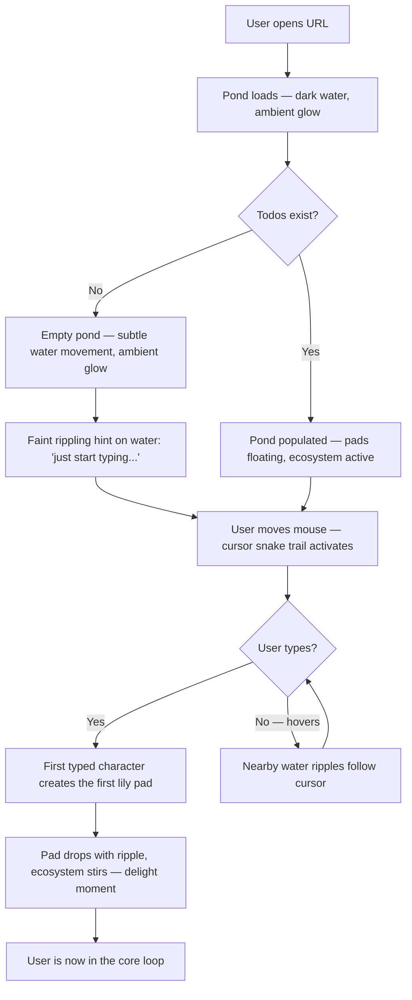
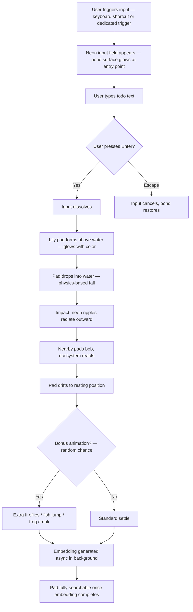
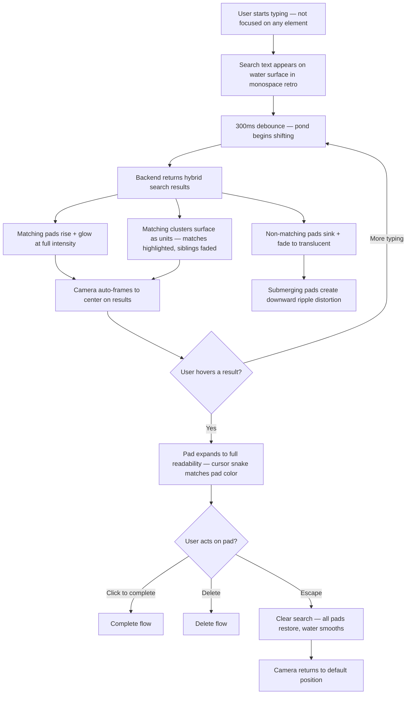
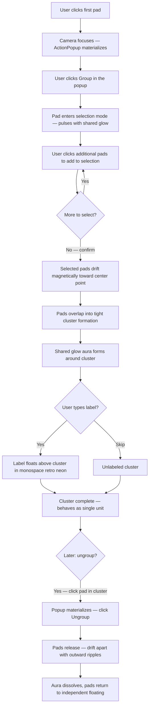

# UX Design Specification - nearform-bmad-todo-app

**Author:** Michael
**Date:** 2026-04-14

---

## Executive Summary

### Project Vision

A visually immersive todo application where task management happens inside a living 3D neon pond. Todos exist as luminescent lily pads floating on a dark water surface, overlapping organically with varying opacity. The interface has no traditional list, no visible search bar, no native browser controls — just a responsive 3D environment where adding a todo drops a new pad into the water with rippling neon light, searching causes matching pads to surface while others submerge, and completing a task transforms its visual state. Inspired by the rag-csv-crew application's neon aesthetic, this todo app pushes the concept further into spatial, immersive interaction.

The application is a Nearform internal demo and BMad method showcase. Desktop only. Chrome only. Every pixel is custom-rendered — cursor, scrollbars, checkboxes, inputs. The system cursor is replaced with a trailing neon snake effect. The entire experience is designed to make internal audiences stop and say "how did they build this?"

### Target Users

**Primary: The demo viewer (Nearform engineers and leadership)**
Encounters the app via a shared link or live presentation. Expects a standard CRUD demo. Gets an immersive 3D experience instead. Tech-savvy, desktop Chrome, appreciates craft.

**Secondary: The daily user (power user with 30+ todos)**
Uses the app regularly. Relies on type-to-search to navigate a dense pond of lily pads. Assigns neon colors for self-organization. Interacts through hover-to-focus and keyboard-driven search.

**Tertiary: The presenter (Michael in a live demo)**
Needs flawless performance on a projected screen. Empty state must look inviting. Every interaction must be smooth and visually impressive in real-time.

### Key Design Challenges

- **Lily pad readability at density** — as todos accumulate, pads shrink and overlap. Must gracefully degrade from readable text → small text → rendered line shapes (Monaco minimap style) without feeling broken
- **Type-to-search discoverability** — no visible search bar means the user must discover that typing anywhere initiates filtering. The empty state or onboarding hint must communicate this
- **3D performance** — a pond full of animated, overlapping, semi-transparent lily pads with real-time ripple effects must maintain 60fps on desktop
- **Custom everything** — replacing the system cursor means every native UI element (inputs, scrollbars, checkboxes) must be custom-built to maintain immersion
- **Focus management** — "anywhere outside a focused element initiates search" requires careful keyboard event handling to avoid conflicts with todo text input

### Design Opportunities

- **The pond as identity** — no other todo app looks or feels like this. The lily pad metaphor is instantly memorable and demo-worthy
- **Search as spectacle** — watching todos surface and submerge with neon ripples turns a utility feature into a visual experience
- **Color as personal expression** — user-assigned neon colors for organization makes the pond visually richer over time, unique to each user
- **Progressive density as emergent behavior** — the pond naturally evolves its visual character as more todos are added, creating a living, organic feel

## Core User Experience

### Defining Experience

The core interaction loop is **pond → drop → find → act**. The user sees a living neon pond, drops thoughts into it as lily pads, finds them later through type-to-search, and acts on them (complete or delete). Each action produces a visual response in the 3D environment — ripples, surfacing, submerging, dissolving. The pond is not a container for a list; it IS the interface. There is no separation between "data view" and "interaction layer."

The primary action — adding a todo — must feel like depositing something alive into the water. The pad materializes, settles among others, causes ripples. The secondary action — searching — transforms the entire pond: matching pads rise and glow while non-matches sink and fade. Both actions produce environmental responses, not UI state changes.

### Platform Strategy

- **Desktop only** — full commitment to immersive 3D experience without touch/responsive compromises
- **Chrome only** — single browser target enables aggressive use of modern APIs and GPU features
- **Mouse + keyboard** — hover for focus, click for action, type anywhere for search
- **GPU-dependent** — Three.js with React Three Fiber, Bloom postprocessing, real-time water simulation
- **No offline** — requires backend for persistence and embedding generation
- **Custom cursor** — neon snake trail (ported from rag-csv-crew CursorSnake component) replaces system cursor entirely, requiring all UI primitives to be custom-built

### Effortless Interactions

- **Adding a todo** — a text input appears contextually (keyboard shortcut or dedicated trigger), user types, presses enter, and a new lily pad drops into the pond with a ripple. No modal, no form, no fields beyond the text itself.
- **Finding a todo** — type anywhere outside a focused element. No search bar to locate, no button to click. The pond responds immediately: matching pads surface, non-matches submerge. Clear the input and the pond restores.
- **Completing a todo** — click the pad, the Action Popup materializes, click Complete. The pad flashes green, a creature emerges into the ecosystem, and the pad dissolves into the water.
- **Deleting a todo** — click the pad, the Action Popup materializes, click Delete. The pad flashes red and dissolves into the water.
- **Color assignment** — click the pad, the Action Popup materializes, click Set Color, pick a neon swatch from the expanded ring. The pad glow transitions to match.

### Critical Success Moments

1. **First 3 seconds** — the pond loads and the user sees something they've never seen in a todo app. The neon water, the floating pads, the custom cursor trail. This is the make-or-break moment for the demo.
2. **First search** — the user types and watches the pond reorganize itself. Pads rise and sink with ripple effects. This is the "this is smarter than I expected" moment.
3. **The density threshold** — when 20+ todos fill the pond and pads shrink into minimap-like line renderings, then the user types and watches specific pads surface from the compressed mass. This demonstrates that the aesthetic isn't just decoration — it scales.
4. **The empty pond** — when no todos exist, the pond should feel inviting, not empty. Subtle water movement, ambient glow, a gentle visual cue that says "drop something in."

### Experience Principles

1. **The pond is the interface** — no separation between data display and interaction surface. Every user action produces an environmental response in the 3D scene.
2. **Type to interact** — keyboard-first for both creation and search. No buttons to find, no menus to navigate. The app responds to what you type.
3. **Visual feedback is the response** — no toast notifications, no success messages. The pond's physical response (ripples, surfacing, dissolving) IS the confirmation.
4. **Density is a feature, not a problem** — the pond gracefully evolves its visual character as todos accumulate, from readable pads to minimap density, making search the natural navigation tool.
5. **Everything is custom** — no native browser UI visible anywhere. Cursor, inputs, scrolling, controls — all rendered within the neon visual language.

## Desired Emotional Response

### Primary Emotional Goals

**Awe + Disbelief (simultaneous):** The user should feel both "this is art" and "wait, this is a *todo app*?" at the same time. The visual craft creates awe; the realization that it's functional creates disbelief. These two emotions layered together produce the demo "wow" moment — the user is impressed by the aesthetics AND surprised that the aesthetics serve a real purpose.

**Curiosity → Discovery:** After the initial impact, the user should feel pulled to explore. Hover a lily pad — it responds. Start typing — the pond transforms. Click a pad — it changes state. Every interaction reveals something, rewarding curiosity with visual feedback.

**Ownership through expression:** As the user assigns neon colors and accumulates todos, the pond becomes *theirs* — a unique visual fingerprint. This creates attachment and a sense of personal space within the aesthetic.

### Emotional Journey Mapping

| Stage | Target Emotion | Trigger |
|---|---|---|
| **First load** | Awe + disbelief | The living neon pond fills the viewport. Custom cursor trail follows mouse. |
| **Empty pond** | Invitation + intrigue | Subtle water movement, ambient glow, gentle cue to "drop something in" |
| **First todo added** | Delight + satisfaction | Lily pad drops into water with ripple — the pond responded to them |
| **Exploring (hover/browse)** | Curiosity + discovery | Pads respond to hover, revealing content, shifting focus |
| **First search** | Surprise + intelligence | Typing transforms the entire pond — "this is smarter than I expected" |
| **Dense pond (20+ todos)** | Mastery + confidence | The minimap-density view feels intentional, search feels essential |
| **Error occurs** | Unease + fascination | A lily pad shows biological decay — browning edges, glitching glow, distorted water — rather than UI error banners |
| **Error resolves** | Relief + resilience | The pad heals, decay fades, the pond restores itself |
| **Mood switch** | Control + playfulness | Toggling between zen and cyberpunk atmospheres transforms the entire environment |
| **Returning** | Familiarity + warmth | The pond remembers — their colored pads are exactly where they left them |

### Micro-Emotions

**Cultivate:**
- **Confidence** — every interaction has clear, immediate visual feedback. The user always knows the pond heard them.
- **Delight** — small surprises in animation details, cursor trail, ripple physics. Reward for paying attention.
- **Mastery** — the type-to-search and hover-to-focus model becomes second nature quickly. Power users feel fast.
- **Fascination** — even error states are visually interesting (biological decay), not frustrating.

**Avoid:**
- **Confusion** — the lack of traditional UI chrome must never feel like missing functionality. Visual cues must compensate.
- **Anxiety** — "did my todo save?" must never be a question. The lily pad appearing IS the confirmation.
- **Boredom** — the pond should feel alive even when idle. Subtle water movement, ambient glow shifts, gentle pad drift.

### Design Implications

| Emotional Goal | UX Design Choice |
|---|---|
| Awe + disbelief | Full-viewport 3D pond scene with no traditional UI elements visible |
| Curiosity → discovery | Every element responds to hover/interaction — no dead zones |
| Delight | Ripple physics, pad drop animation, cursor trail, bloom effects |
| Confidence | Lily pad materialization IS the save confirmation — no toasts or modals |
| Fascination in errors | Biological decay metaphor — wilting/browning/glitching pads instead of error banners |
| Control + playfulness | Configurable atmosphere — zen (calm, soft ripples, muted glow) vs. cyberpunk (pulsing, bright, active waves) |
| Mastery | Progressive density that rewards search-driven navigation |
| Ownership | User-assigned neon colors create a unique visual fingerprint per person |

### Emotional Design Principles

1. **The pond is alive** — idle state has subtle movement (water, glow shifts, gentle pad drift). The environment breathes even when the user isn't acting.
2. **Errors are organic, not clinical** — failure states use the pond metaphor (biological decay, distortion, glitching water) rather than red banners or modal dialogs.
3. **Atmosphere is configurable** — zen mode (contemplative, soft ripples, muted glow, slower animations) vs. cyberpunk mode (electric, pulsing neon, active waves, faster transitions). User controls the mood.
4. **Every response is environmental** — the pond ripples, pads surface or sink, glows intensify or fade. No system-style notifications. The 3D world IS the feedback layer.
5. **Surprise scales with attention** — casual users see the big moments (drop, search, ripple). Attentive users notice cursor trail color shifts, pad drift patterns, subtle glow breathing. Layers of delight for different attention levels.

### Pond Ecosystem

The pond is populated by ambient wildlife whose density and variety scale with the number of active todos. The ecosystem creates emergent visual richness that rewards usage.

**Creature types:**
- Fireflies — neon trails drifting above the water surface
- Frogs — perch on lily pads, occasionally hop between them
- Fish — neon silhouettes gliding beneath the water surface
- Dragonflies — dart across the scene with quick, erratic movement
- Water striders — skim the surface tension with ripple effects

**Ecosystem scaling:**

| Todo Count | Ecosystem State | Visual Character |
|---|---|---|
| 0-3 | Sparse | Quiet pond, single firefly, still water. Inviting but waiting. |
| 5-10 | Awakening | A few fireflies, a frog appears, fish begin moving. Life stirs. |
| 15-25 | Thriving | Multiple creature types active, rich ambient movement. The pond feels alive. |
| 30+ | Lush | Dense wildlife, firefly swarms, frog chorus, schooling fish. Teeming ecosystem. |

**Ecosystem-error interaction:** When a lily pad enters an error state (biological decay), nearby creatures may react — fish scatter, frogs hop away from the affected pad, fireflies dim near the decay. When the error resolves, life returns.

## UX Pattern Analysis & Inspiration

### Inspiring Products Analysis

**RAG CSV Crew (primary visual reference)**
The existing Nearform application provides the complete visual language: neon color palette, circuit-board backgrounds, 3D isometric objects via Three.js/React Three Fiber, custom cursor snake trail, retro-futuristic typography, and fully custom UI primitives (scrollbars, checkboxes, selects). The todo app inherits this DNA and extends it into a spatial 3D environment.

- Proven component library to port: CursorSnake, CircuitBoard, NeonCheckbox, NeonScrollbar, NeonSelect, LightningBorder, NeonScene
- Same tech stack: React 18 + TypeScript + Vite + Three.js + Python/FastAPI + PostgreSQL/pgvector
- Established neon color palette as CSS variables (pink #ff10f0, cyan #00eeff, orange #ff6600, green #39ff14, gold #ffd700)

**Casino games (interaction psychology reference)**
Casino UX is optimized for sustained attention through randomized delight, anticipation mechanics, and disproportionate visual reward. The todo pond borrows these psychological patterns:

- **Anticipation before payoff** — a todo drop has a brief build-up (the pad forms, hovers, then *drops* into the water) rather than instant appearance
- **Randomized celebration intensity** — completing a todo occasionally triggers bonus effects (extra fireflies, particle bursts, fish jump). Not every time — the unpredictability keeps it interesting
- **Ambient magnetism** — the pond's idle state has enough movement (creatures, ripples, glow shifts) to hold peripheral attention, like a casino floor you can't look away from
- **Near-miss engagement** — ecosystem creatures have randomized emergent behaviors (frog catches firefly, fish leap, dragonfly lands on a pad) creating micro-moments of delight

**Type-to-navigate tools (interaction model reference)**
VS Code command palette, Raycast, Spotlight — applications where typing anywhere is the primary navigation method. The todo pond borrows:

- **Global keyboard capture** — typing outside a focused element initiates search immediately
- **Progressive filtering** — results narrow in real-time as you type, with instant visual feedback
- **Escape to clear** — single keypress restores the full unfiltered view

### Transferable UX Patterns

**Spatial layout (from casino/game UI):**
- Elements positioned organically, not in rigid grids — lily pads float with natural spacing and overlap
- Visual hierarchy through proximity and focus rather than list ordering
- Environmental responses to user actions (ripples, creature reactions) rather than UI state indicators

**Randomized delight (from casino mechanics):**
- Variable-intensity feedback — most popup Complete actions produce a standard green flash and creature emerge; some randomly escalate to particle bursts, creature reactions, or bonus animations
- Rarity tier distribution for the creature that emerges from the pad during the green flash (not from a cracked egg):

| Rarity | Creatures | Chance | Visual Impact |
|---|---|---|---|
| Common | Firefly, water strider | ~50% | Subtle ambient addition |
| Uncommon | Frog, dragonfly, butterfly | ~35% | Noticeable, fun to watch |
| Rare | Fish (splashes off pad into water), turtle | ~12% | Exciting, brief celebration |
| Legendary | Golden koi, neon phoenix, glowing jellyfish | ~3% | Major visual event, particle burst |

- Emergent ecosystem moments — unpredictable creature behaviors create "did you see that?" micro-events
- Anticipation pacing — actions have brief build-up animations before resolution, creating satisfying rhythm

**Type-to-navigate (from command palettes):**
- No visible search UI — keyboard input directly transforms the environment
- Progressive refinement — results update per-keystroke with debouncing
- Escape as universal "reset" — clears search and restores full pond view

**Ambient soundscape (from casino/game environments):**
- Layered ambient audio that scales with ecosystem density (water, crickets, frogs)
- Discrete interaction sounds (splash on add, chime on complete, soft pad-dissolve on delete)
- Slightly synthetic/processed natural sounds to match neon aesthetic
- Sound is the last-implemented feature — additive polish, not a dependency

### Anti-Patterns to Avoid

- **Traditional list UI** — no vertical scrolling lists, no rows, no table-like layouts. The pond IS the layout.
- **Modal dialogs** — no confirmation modals, no "are you sure?" popups. Actions are direct; undo is the safety net.
- **Toast notifications** — no slide-in success/error messages. The pond's physical response IS the notification.
- **Visible chrome** — no toolbars, sidebars, headers, footers. The viewport is 100% pond.
- **Static idle state** — the pond must never feel frozen or lifeless. Something always moves.
- **Uniform feedback** — every interaction producing the exact same animation creates predictability. Randomize intensity and details.

### Design Inspiration Strategy

**Adopt directly from rag-csv-crew:**
- CursorSnake component, neon color palette, custom UI primitives, CircuitBoard background pattern, Three.js/React Three Fiber setup with Bloom postprocessing

**Adapt from casino/game UX:**
- Randomized celebration intensity for todo completion
- Anticipation pacing on todo creation (form → hover → drop → ripple)
- Emergent ecosystem creature behaviors as ambient delight
- Ambient soundscape with interaction-triggered audio (last feature implemented)

**Adapt from command palettes:**
- Global type-to-search with no visible search bar
- Progressive filtering with environmental visual response
- Escape-to-reset as universal clear

**Avoid from traditional todo apps:**
- Lists, grids, cards, modals, toasts, toolbars, settings pages, onboarding flows

### Grouping & Clustering

**Organic clustering** — lily pads can be grouped into tight clusters that float as a unit on the pond surface. Clusters share a connecting glow aura and an optional floating label. Structure is flat — no nested groups.

**Cluster interactions:**
- Select multiple pads → they magnetically drift together and bond into a cluster
- Ungroup → pads release with outward ripple, drift apart
- Drag individual pads in/out of existing clusters
- Clusters drift together on the pond as a single unit

**Cluster search behavior:**
- Any match in a cluster surfaces the entire cluster
- Matching pads glow at full intensity, foregrounded
- Non-matching siblings remain visible but faded/transparent — providing group context
- Non-matching clusters submerge as normal

### Sound Design Specification

**Implementation priority:** Last feature — ship visual experience complete, add sound as final polish layer.

**Ambient layer (always present, scales with ecosystem):**

| Sound | Behavior | Volume Scaling |
|---|---|---|
| Water ambient | Continuous loop, subtle movement | Base level, always present |
| Cricket chirps | Loop, density increases with todo count | Scales with ecosystem state |
| Frog croaks | Random intervals, more frequent at higher density | Scales with ecosystem state |
| Wind/atmosphere | Subtle background texture | Constant, low |

**Interaction sounds (triggered by user actions):**

| Sound | Trigger | Character |
|---|---|---|
| Splash/drop | Todo added | Water drop with slight synthetic reverb |
| Completion chime | Todo completed | Tonal chime, occasionally enhanced with bonus particles |
| Pad dissolve | Todo deleted | Soft synthesized dissolve — subtle, matching the visual |
| Ripple wash | Search filtering | Soft water movement, panning with results |
| Surface break | Search result surfacing | Gentle water break sound |

**Audio UX rules:**
- Start muted — "click to enable sound" prompt on first visit, in-theme
- Mute toggle always accessible (subtle, in-theme — perhaps a firefly icon)
- Sounds are slightly synthetic/processed to match the neon aesthetic — not purely naturalistic
- Spatial audio where possible — sounds positioned relative to the action location in the pond

## Design System Foundation

### Design System Choice

**Custom Design System** — ported and extended from the rag-csv-crew application. No established UI framework (MUI, Chakra, Tailwind) applies — the entire interface is a Three.js 3D scene with custom-rendered UI primitives. The rag-csv-crew codebase serves as the component library and visual language source.

### Rationale for Selection

- The 3D pond interface has no equivalent in any component library — lily pads, water simulation, ecosystem creatures are all custom Three.js/React Three Fiber work
- The custom cursor requirement (neon snake trail) forces all native UI elements to be rebuilt anyway — no framework shortcuts survive
- The rag-csv-crew app already provides proven implementations of the exact primitives needed (custom inputs, scrollbars, checkboxes, 3D scene management)
- Visual uniqueness is the primary product goal — using a standard design system would undermine the core value proposition

### Implementation Approach

**Port from rag-csv-crew:**

| Component | Source | Adaptation Needed |
|---|---|---|
| CursorSnake | `components/CursorSnake/` | Direct port — same cursor trail behavior |
| NeonCheckbox | `components/NeonCheckbox/` | Adapt for lily pad completion toggle |
| NeonScrollbar | `components/NeonScrollbar/` | May not need — pond is spatial, not scrollable |
| NeonScene | `components/Dashboard3D/NeonScene.tsx` | Adapt canvas wrapper for pond scene instead of card grid |
| CircuitBoard | `components/CircuitBoard/` | Evaluate — pond may replace circuit-board as background |
| LightningBorder | `components/LightningBorder/` | Adapt for lily pad focus/hover effects |
| CSS Variables | `src/index.css` | Direct port — neon color palette (#ff10f0, #00eeff, #ff6600, #39ff14, #ffd700) |

**Build new:**

| Component | Purpose |
|---|---|
| PondScene | Three.js water surface with ripple physics and neon lighting |
| LilyPad | Individual todo element — 3D pad with text, color, opacity, hover/focus states |
| LilyPadCluster | Grouped pad formation with shared glow aura |
| EcosystemManager | Spawns and animates creatures (fireflies, frogs, fish, dragonflies) based on todo density |
| AtmosphereController | Zen/cyberpunk mode toggle — adjusts water speed, glow intensity, animation pacing |
| PondSearch | Global keyboard capture, search state management, surface/submerge animation orchestration |
| TodoInput | Contextual text input for creating new todos — neon-styled, appears on trigger |
| ColorPicker | Neon color assignment for lily pads — compact, in-theme |
| SoundManager | Audio layer — ambient loops, interaction triggers, spatial positioning (last implemented) |

### Customization Strategy

**Design tokens (CSS custom properties):**
- `--neon-pink: #ff10f0` — primary accent
- `--neon-cyan: #00eeff` — secondary accent
- `--neon-orange: #ff6600` — warning/attention
- `--neon-green: #39ff14` — success/completion
- `--neon-gold: #ffd700` — highlight/special
- `--pond-dark: #000000` — base background
- `--water-surface: rgba(0, 20, 40, 0.8)` — water color
- `--glow-intensity: 1.0` — base bloom strength (scales with atmosphere mode)

**Atmosphere modes:**
- Zen: `--glow-intensity: 0.6`, slower animation timing, muted colors, gentle ripples
- Cyberpunk: `--glow-intensity: 1.4`, faster animations, saturated colors, active waves

## Defining Experience

### The One-Liner

**"Drop thoughts into a living neon pond. Find them by thinking out loud."**

### Product Personality

The pond is **alive** — it breathes, moves, and evolves even when you're not touching it. It's **immersive** — there is no "app" surrounding the pond, the pond IS everything. It's **interactive** — every hover, click, and keystroke produces a visible environmental response. It's **responsive** — the pond hears you and reorganizes itself around your intent. It's **fun** — randomized creature behaviors, surprising celebration animations, and a custom cursor trail make you want to keep playing. It's **engaging** — the ecosystem scaling, color customization, and atmosphere modes give you reasons to come back and see how your pond has evolved.

### User Mental Model

The closest mental model is a **living koi pond you can think into**. Users don't "add items to a list" — they drop thoughts into a body of water that keeps them alive. They don't "search a database" — they speak to the pond and it surfaces what matters. The pond is a companion that holds your thoughts, not a tool that stores your data.

**Mental model progression:**
1. **First encounter:** "This is art" → passive observation
2. **First interaction:** "Wait, I can put things in here" → discovery
3. **Habitual use:** "The pond knows what I mean" → trust
4. **Ownership:** "This is MY pond" → attachment (colors, density, ecosystem state)

### Success Criteria for Core Experience

- User drops a todo into the pond and *feels* it land — the ripple, the pad settling, the ecosystem responding
- User types a vague concept and watches the right todos surface — "the pond understood me"
- User returns after a day and the pond is exactly as they left it — their colors, their clusters, their ecosystem density
- A first-time viewer watches someone else use it and immediately wants to try — the interaction is visually self-evident
- Nobody ever asks "where's the search bar?" — they just start typing because the pond *invites* interaction

### Novel UX Patterns

This product is almost entirely novel interaction design. No established patterns transfer directly.

**Novel patterns that need visual affordance:**
- **Type-anywhere search** — no search bar exists. The empty pond must hint at this (perhaps faint rippling text on the water: "just start typing...")
- **Hover-to-focus in 3D space** — lily pads respond to mouse proximity, not just direct hover. Nearby pads subtly shift as the cursor approaches.
- **Progressive density** — the pond doesn't paginate or scroll. It compresses. Users need to understand that density IS the natural state, not a bug.
- **Organic grouping** — dragging pads together to cluster them has no standard web precedent. The magnetic drift animation must make the behavior self-evident.

**Familiar metaphors that ground the novelty:**
- Dropping something into water (universal physical intuition)
- Objects floating and sinking (buoyancy = relevance)
- Living things responding to environment (ecosystem = activity indicator)
- Color = category (universal organizational metaphor)

### Experience Mechanics

**1. Adding a Todo (The Drop)**

| Phase | User Action | Pond Response | Duration |
|---|---|---|---|
| Trigger | Keyboard shortcut or dedicated trigger | A subtle glow appears at the water surface — the pond is ready | Instant |
| Input | User types todo text in neon-styled input | Text appears in retro-futuristic font, cursor snake pauses nearby | User-paced |
| Commit | User presses Enter | Input dissolves | 100ms |
| Formation | — | A lily pad forms in the air above the pond surface, glowing with the default or chosen neon color | 200ms |
| Drop | — | The pad falls into the water with realistic physics | 300ms |
| Impact | — | Neon ripples radiate outward from impact point. Nearby pads bob gently. Ecosystem reacts (fish scatter, fireflies flicker). | 500ms |
| Settle | — | Pad drifts to its resting position among other pads, opacity normalizes | 400ms |

**2. Finding a Todo (The Search)**

| Phase | User Action | Pond Response | Duration |
|---|---|---|---|
| Trigger | Start typing anywhere (outside focused element) | Faint search text appears on water surface. Pond begins to shift. | Instant |
| Filter | Each keystroke refines | Matching pads rise, glow brighter, come to foreground. Non-matching pads sink, fade, become translucent. Clusters surface as units with matching members highlighted. | 300ms debounce |
| Ripple | — | Surfacing pads create upward ripples. Submerging pads create downward distortion. | Continuous |
| Focus | Hover a surfaced result | Pad expands to full readability. Cursor snake glows in the pad's color. | 150ms |
| Clear | Press Escape | All pads restore to resting state. Water smooths. Search text dissolves. | 400ms |

**3. The Action Popup (Pad-Level Actions)**

Every pad-level interaction — completion, deletion, color assignment, grouping — flows through one primitive: an in-scene neon wireframe popup that materializes when a pad is clicked.

| Phase | User Action | Pond Response | Duration |
|---|---|---|---|
| Focus | Click the lily pad | Camera focuses on the pad. ActionPopup wireframe draws in from anchor point at upper-right (or flipped to stay on-screen). | 300ms |
| Dwell | — | Popup holds steady with action buttons: Complete, Delete, Set Color, Group, Ungroup (contextual) | User-paced |
| Set Color expand | Click Set Color | Swatch ring unfolds inside the popup. Hovering a swatch previews the color on the pad's glow in real-time. Clicking a swatch commits. | 250ms expand, instant preview |
| Dismiss | Click outside, Escape, or action committed | Popup collapses back to anchor point, camera returns to prior position | 300ms |

**4. Completing a Todo (The Green Flash)**

Completion is a soft-state transition — the record persists in the database with `completed=true`, but the pad no longer renders in the pond and no longer appears in search.

| Phase | User Action | Pond Response | Duration |
|---|---|---|---|
| Trigger | Click Complete in the ActionPopup | Popup dismisses | 200ms |
| Flash | — | Pad flashes bright neon green, full bloom. Occasional bonus: particle burst, frog croak, firefly swarm. | 300ms |
| Emerge | — | A creature spawned from this pad emerges from the flash and joins the ecosystem | 300ms |
| Dissolve | — | Pad dissolves into the water with outward ripple. Nearby creatures react. | 500ms |
| Settle | — | Water smooths where pad was. Surrounding pads drift slightly to fill the space. | 400ms |

**5. Deleting a Todo (The Red Flash)**

Deletion uses the same dissolve gesture as completion, differentiated only by flash color. The record persists in the database with `deleted=true`, but the pad no longer renders and no longer appears in search.

| Phase | User Action | Pond Response | Duration |
|---|---|---|---|
| Trigger | Click Delete in the ActionPopup | Popup dismisses | 200ms |
| Flash | — | Pad flashes bright neon red, full bloom | 300ms |
| Dissolve | — | Pad dissolves into the water with outward ripple. Nearby creatures react. | 500ms |
| Settle | — | Water smooths where pad was. Surrounding pads drift slightly to fill the space. | 400ms |

**6. Grouping Todos (The Cluster)**

| Phase | User Action | Pond Response | Duration |
|---|---|---|---|
| Initiate | Click a pad → click Group in the popup | Pad enters selection mode, pulses with shared glow | Instant |
| Select | Click additional pads to add to selection | Each selected pad joins the shared pulse | Per-selection |
| Group | Confirm | Selected pads drift magnetically toward each other, overlapping into a tight cluster. Shared glow aura forms around the cluster. | 500ms |
| Label | Optional: type a cluster label | Label text floats above the cluster in neon | User-paced |
| Ungroup | Click a pad in the cluster → click Ungroup in the popup | Pads release, drift apart with outward ripples. Aura dissolves. | 500ms |

## Visual Design Foundation

### Color System

**Primary neon palette (from rag-csv-crew):**

| Token | Hex | Role |
|---|---|---|
| `--neon-pink` | #ff10f0 | Primary accent, active states, cursor trail highlight |
| `--neon-cyan` | #00eeff | Secondary accent, water reflections, search indicators |
| `--neon-orange` | #ff6600 | Warning, attention, error-adjacent states |
| `--neon-green` | #39ff14 | Success, completion glow, ecosystem creatures |
| `--neon-gold` | #ffd700 | Highlight, special events, bonus celebrations |

**Environment colors:**

| Token | Value | Role |
|---|---|---|
| `--pond-dark` | #000000 | Base background beneath water |
| `--water-surface` | rgba(0, 20, 40, 0.8) | Dark blue-green water tint — subtle natural feel |
| `--water-deep` | rgba(0, 10, 25, 0.95) | Deep water for submerged/sinking pads |
| `--water-reflection` | rgba(0, 238, 255, 0.05) | Subtle cyan reflection shimmer on water surface |

**Lily pad colors (user-assignable):**
Each todo can be assigned any neon color from the palette. Default color for new pads is `--neon-cyan`. Completed pads desaturate to 40% of their assigned color's intensity.

**Glow system:**
Every neon color has a corresponding glow variant using CSS `box-shadow` or Three.js Bloom postprocessing. Glow intensity scales with `--glow-intensity` (controlled by atmosphere mode).

### Typography System

**Dual-font strategy:**

| Usage | Font | Rationale |
|---|---|---|
| UI labels, titles, cluster labels, search text | Retro-futuristic monospace (e.g., "Share Tech Mono", "VT323", or custom) | Consistent with rag-csv-crew identity, establishes neon/retro tone |
| Todo text on lily pads | Clean sans-serif (e.g., "Inter", "IBM Plex Sans") | Readability at all sizes including progressive density compression |

**Type scale:**

| Element | Size | Weight | Font |
|---|---|---|---|
| App title / brand | 32px | Bold | Monospace retro |
| Cluster labels | 16px | Bold | Monospace retro |
| Search input text | 20px | Regular | Monospace retro |
| Lily pad text (full size) | 14px | Regular | Sans-serif |
| Lily pad text (medium density) | 11px | Regular | Sans-serif |
| Lily pad text (high density) | 8px | Regular | Sans-serif |
| Lily pad text (minimap density) | — | — | Rendered as colored lines, not readable text |

**Text rendering on lily pads:**
- Full size: readable text, full font rendering
- Medium density: smaller but still legible
- High density: very small, requires hover-to-focus to read
- Minimap density: text replaced with proportional colored lines (Monaco minimap style) — shape of text visible, content requires search to access

### Spacing & Layout Foundation

**No traditional spacing grid.** The pond is a 3D scene — lily pads are positioned by physics simulation, not CSS grid. Spacing is governed by:

- **Pad spacing algorithm** — minimum distance between pad centers, with allowed overlap at edges
- **Cluster cohesion** — grouped pads overlap more tightly than ungrouped pads
- **Density scaling** — as todo count increases, minimum spacing decreases and pad size shrinks
- **Focus expansion** — hovered pads temporarily claim more space, pushing neighbors slightly

**Viewport usage:**
- 100% viewport width and height — no scrolling, no margins, no chrome
- Pond scene fills the entire browser window
- Responsive to window resize — pond redistributes pads to fill available space

**Z-axis layering (depth in 3D):**

| Layer | Content | Z-depth |
|---|---|---|
| Background | Dark water, ambient reflections | Deepest |
| Submerged | Non-matching search results, deleted pads sinking | Below surface |
| Water surface | Ripple effects, water striders | Surface plane |
| Resting pads | Active lily pads at normal state | Slightly above surface |
| Focused pad | Hovered/active lily pad | Elevated above others |
| Ecosystem | Fireflies, dragonflies | Above pads |
| Cursor | Neon snake trail | Topmost layer |
| UI overlay | Search text, todo input, color picker | Screen-space overlay on 3D scene |

### Accessibility Considerations

**Intentionally limited scope (v1):**
- No WCAG compliance requirements — this is an internal demo, desktop Chrome only
- No screen reader support — the 3D pond paradigm is inherently visual
- No keyboard-only navigation beyond type-to-search and keyboard shortcuts
- No high-contrast mode — the neon-on-dark palette IS the product identity

**Baseline considerations maintained:**
- Todo text uses clean sans-serif for maximum readability within the neon context
- Focused lily pads expand to readable size regardless of density
- Neon colors on dark background provide strong contrast ratios naturally (neon green on black = ~11:1)
- Error states are communicated through visual metaphor (biological decay) AND through the todo still being accessible/recoverable

## Design Direction Decision

### Design Directions Explored

Four pond visualization approaches evaluated:
- **A: Top-Down** — simplest, map-like, best readability but least immersive
- **B: Angled Perspective** — dramatic, depth-rich, but fixed viewpoint limits density handling
- **C: Floating Void** — abstract, simpler rendering, but loses the pond metaphor
- **D: Hybrid Angled + Interactive Camera** — most immersive, handles density through zoom, explorable

### Chosen Direction

**Direction D: Hybrid Angled with Interactive Camera**

Default camera sits at ~30-40 degrees looking across the pond surface toward a subtle horizon. The user can orbit, pan, and zoom the camera to explore the pond spatially.

**Camera controls:**
- **Scroll wheel** — zoom in/out (zoom in to read individual pads, zoom out to see the full pond)
- **Click-drag on water** — pan the camera across the pond surface
- **Right-click drag or modifier+drag** — orbit camera angle
- **Double-click empty water** — reset camera to default position
- **Auto-frame on search** — when search results surface, camera smoothly adjusts to frame the visible results

**Zoom behavior:**
- Zoomed out: full pond visible, pads at minimap density, ecosystem creatures visible as ambient movement
- Default zoom: natural working distance, pads readable on hover, comfortable density
- Zoomed in: individual pads large and fully readable, water surface detail visible, creature detail visible

**Camera animation:**
- All camera transitions are smooth (eased, 300-500ms)
- Camera auto-adjusts on window resize to maintain framing
- Search results trigger subtle camera movement to center on the result cluster

### Design Rationale

- **Density handling through zoom** — rather than pads shrinking to minimap density at a fixed camera distance, the user can zoom out to see everything or zoom in to read. Progressive density still applies, but zoom gives the user agency over how they view it.
- **Demo spectacle** — a camera you can orbit around a 3D pond is a "wait, I can do THAT?" moment in a live demo. The presenter can zoom in to show detail, zoom out to show scale.
- **Natural exploration** — the pond becomes a place you move through, not just a screen you look at. This reinforces the "living koi pond" mental model.
- **Search + camera synergy** — search surfaces results AND the camera frames them. The whole environment conspires to show you what you're looking for.

### Implementation Approach

**Three.js camera setup:**
- `OrbitControls` from Three.js/React Three Fiber for zoom, pan, orbit
- Configurable constraints: min/max zoom distance, orbit angle limits (prevent going underwater), pan boundaries
- Smooth damping on all camera movements for polished feel
- Programmatic camera transitions for search-triggered framing

**Performance considerations:**
- Level-of-detail (LOD) rendering — reduce pad detail at far zoom distances
- Frustum culling — only render pads visible in current camera view
- Ecosystem creatures simplified at far zoom, detailed at close zoom

**Atmosphere mode interaction:**
- Zen mode: slower camera damping, gentler transitions, camera drift when idle
- Cyberpunk mode: snappier camera response, faster transitions, no idle drift

## User Journey Flows

### Flow 1: First Encounter (New User Arrives)

**Key design decisions:**
- No onboarding overlay, no tutorial, no welcome modal, no tutorial egg, no guided prompts
- The empty pond itself IS the onboarding — subtle water movement and ambient glow invite interaction
- "Just start typing..." ripple text is the only explicit hint
- The user's first typed character creates their first lily pad — that IS the onboarding
- Cursor snake activates immediately — first moment of "this is different"

### Flow 2: Adding a Todo (The Drop)

**Key design decisions:**
- Embedding generation is invisible to user — pad appears instantly, search capability follows async
- Random bonus animations on ~20% of adds (casino mechanic)
- Escape always cancels cleanly — no data loss risk

### Flow 3: Finding a Todo (The Search)

**Key design decisions:**
- Full-text results appear first (fast), vector results refine ranking (slower) — progressive enhancement
- Camera auto-framing means the user doesn't have to manually navigate to results
- Escape is always the universal reset — clear search, restore pond, reset camera

### Flow 4: Grouping Todos (The Cluster)

**Key design decisions:**
- Grouping is initiated through the ActionPopup, consistent with every other pad-level action
- Magnetic drift animation makes grouping feel physical, not digital
- Clusters are visual units — they drift together, surface together in search, drag as a unit
- Ungroup is also invoked through the popup (on any pad inside the cluster)

### Flow 5: Live Demo Walkthrough

```mermaid
flowchart TD
    A[Presenter opens app on projected screen] --> B[Empty pond — ambient glow fills room display]
    B --> C[Cursor snake trail visible on projection — immediate wow]
    C --> D[Presenter types — first pad drops with ripple]
    D --> E[Adds 3-4 more todos — pond comes alive]
    E --> F[Ecosystem awakens — fireflies appear]
    F --> G[Presenter clicks a pad — camera focuses, neon wireframe popup materializes]
    G --> H[Clicks Set Color — swatch ring expands — clicks a color — pad glow transitions]
    H --> I[Clicks another pad — popup — clicks Group — selects a second pad — magnetic cluster demo]
    I --> J[Clicks a pad — popup — clicks Complete — pad flashes green, creature emerges into ecosystem, pad dissolves]
    J --> K[Clicks a pad — popup — clicks Delete — pad flashes red, dissolves into water]
    K --> L[Presenter types search query — pond reorganizes dramatically]
    L --> M[Camera auto-frames results — visual spectacle]
    M --> N[Presenter toggles atmosphere — zen to cyberpunk]
    N --> O[Entire environment transforms — crowd reaction]
    O --> P[Presenter zooms out — shows full pond overview]
    P --> Q[Zooms into a specific pad — detail visible]
    Q --> R[Demo complete — Q&A]
```

**Key design decisions:**
- Demo flow is designed to escalate visual impressions: cursor → drop → popup → completion burst → search → atmosphere → camera
- Each step introduces a new capability AND a new visual moment
- The popup is the central interaction surface — every pad-level action flows through it
- Completion and deletion share the same dissolve gesture, differentiated only by flash color (green vs red)
- The atmosphere toggle is the climax — the entire world changes

### Journey Patterns

**Universal patterns across all flows:**

- **Escape always resets** — clear search, cancel input, deselect, reset camera. One key, always safe.
- **Visual response IS confirmation** — no toasts, no modals, no banners. The pond's physical response confirms every action.
- **Progressive revelation** — each interaction reveals the next possibility. First-time users discover by doing.
- **Camera follows intent** — search frames results, adding pads keeps them in view, zooming is always available.

### Flow Optimization Principles

- **Zero dead ends** — every state has a clear next action or escape path
- **Keyboard-first, mouse-enhanced** — type to search, type to add, keyboard shortcuts for grouping. Mouse for spatial interaction (hover, drag, zoom).
- **Fail silently, recover visibly** — if embedding fails, the pad still exists. If search returns nothing, the pond goes still (empty result = calm water). Errors show as biological decay, not error codes.
- **Anticipation before resolution** — every action has a brief build-up (pad forming, water shifting, pads drifting) that creates satisfying rhythm.

## Component Strategy

### Ported Components (from rag-csv-crew)

| Component | Source | State in Todo App |
|---|---|---|
| **CursorSnake** | `CursorSnake/` | Direct port — neon hexagon chain cursor with spring animation |
| **NeonScene** | `Dashboard3D/NeonScene.tsx` | Adapted — canvas wrapper reconfigured for pond scene with OrbitControls |
| **LightningBorder** | `LightningBorder/` | Adapted — used for cluster glow aura and focused pad highlight |
| **CSS Variables** | `index.css` | Direct port — full neon color palette |
| **NeonScrollbar** | `NeonScrollbar/` | Available for any scrolling overlays (not required by core pond flow) |

*Note: NeonCheckbox from rag-csv-crew is NOT used — completion is performed through the ActionPopup's Complete button (pad flash + dissolve).*

### Custom Components — Pond Environment

#### PondScene

**Purpose:** The primary 3D environment — a dark blue-green water surface with ripple physics, neon reflections, and ambient lighting.
**Content:** Water surface, ambient reflections, ripple effects, horizon line.
**States:**
- Idle — subtle water movement, ambient reflections
- Active — ripples from user actions (drops, searches, deletes)
- Zen mode — slow ripples, muted glow, calm movement
- Cyberpunk mode — active waves, bright glow, faster ripples
**Interaction:** Click-drag to pan, scroll to zoom, right-drag to orbit. Double-click water to reset camera.

#### LilyPad

**Purpose:** Individual todo element — a floating 3D pad on the water surface displaying todo text.
**Content:** Todo text (sans-serif), neon glow border in assigned color.
**States:**
- Resting — floating at water level, partial opacity, assigned neon color
- Hovered — pad rises slightly, glow amplifies (pre-click affordance only — no action committed on hover)
- Focused (popup open) — camera focuses on the pad, ActionPopup wireframe anchored to upper-right
- Completing — flashes neon green, a creature emerges, pad dissolves (terminal animation; record soft-marked `completed=true`)
- Deleting — flashes neon red, pad dissolves (terminal animation; record soft-marked `deleted=true`)
- Error — biological decay: wilt, browning, glitching glow, textures degrade
- Searching (match) — rises, glows at full intensity, foregrounded
- Searching (no match) — sinks below surface, fades to translucent
- Minimap density — pad shrinks, text becomes rendered colored lines
**Interaction:** Click to open the ActionPopup. Drag to move or drag into/out of clusters. All terminal actions (Complete, Delete) and stateful actions (Set Color, Group, Ungroup) are invoked through the popup.

### Custom Components — Action Popup

All pad-level actions are invoked through a single in-scene control surface: a neon wireframe Action Popup that materializes when a pad is clicked and dismisses when the user acts, clicks outside, or presses Escape.

#### ActionPopup

**Purpose:** In-scene neon wireframe panel providing all pad-level actions in one place.
**Position:** Anchored to the clicked pad's upper-right in camera space, auto-repositioned to stay fully within the viewport (flips to upper-left, below, or above as needed when the pad is near a screen edge).
**Appearance:** Neon wireframe rectangle with thin glowing edges, slight parallax inside the 3D scene. Bloom postprocessing gives the frame and contents a soft outward glow. Monospace retro typography matches the rest of the environment.

| State | Visual | Trigger |
|---|---|---|
| Materializing | Wireframe edges draw in from corner points, contents fade in, camera focuses on the pad | Click on pad |
| Active | Steady wireframe frame with action buttons visible; pad held in focused state | — |
| Dismissing | Frame collapses back to its origin point, contents fade out, camera returns to prior position | Click outside, Escape, or action committed |

**Behavior rules:**
- Only one ActionPopup is open at a time — opening a popup on a new pad dismisses the previous one
- The popup materializes in sync with the camera focus animation so the user's attention and the UI surface land together
- Clicking inside the popup never dismisses it; only clicking empty water, pressing Escape, or committing an action closes it

#### PopupActionButton

**Purpose:** Individual neon wireframe button representing one pad-level action.
**Actions exposed:** Complete, Delete, Set Color, Group, Ungroup (Ungroup shown only when the pad belongs to a cluster; Group shown only when multi-select or clustering context applies).
**Appearance:** Thin neon wireframe rectangle with a monospace retro label. Glow provided by Bloom postprocessing, matching the pad's assigned color where relevant.

| State | Visual | User Action |
|---|---|---|
| Rest | Wireframe edges at base glow | — |
| Hover | Glow amplifies, edges brighten, label intensifies | Mouse enters button |
| Press | Brief inward flash, then triggers the associated action | Click |

**Action outcomes:**
- **Complete** — pad flashes green, a creature emerges from the pad and joins the ecosystem, pad dissolves into the water; record persists with `completed=true` but no longer renders or appears in search
- **Delete** — pad flashes red, pad dissolves into the water; record persists with `deleted=true` but no longer renders or appears in search
- **Set Color** — expands the PopupColorSwatch sub-panel inside the ActionPopup
- **Group / Ungroup** — triggers cluster formation or dissolution (magnetic drift, shared glow aura, optional label, drag-as-unit mechanics)

#### PopupColorSwatch

**Purpose:** Sub-panel expansion inside the ActionPopup for assigning or changing a pad's neon color.
**Trigger:** Clicking the Set Color PopupActionButton.
**Appearance:** Ring of 5 neon swatches — pink #ff10f0, cyan #00eeff, orange #ff6600, green #39ff14, gold #ffd700 — rendered as glowing wireframe discs inside the popup frame.

| Phase | Visual | User Action |
|---|---|---|
| Expand | Swatch ring unfolds outward from the Set Color button | Click Set Color |
| Preview | Hovered swatch lights up; the underlying pad's glow shifts to that color in real-time | Hover a swatch |
| Commit | Swatch flashes, ring collapses, pad glow settles on the chosen color, subtle ripple | Click a swatch |
| Collapse without change | Ring folds back, pad glow restores to its original color | Escape or click Set Color again |

### Custom Components — Pond Residents

#### EcosystemManager

**Purpose:** Spawns and manages ambient wildlife (fireflies, frogs, dragonflies, water striders, fish). Creature population is the sum of: baseline ambient creatures + creatures that emerge from pads on completion.
**Creature sources:**
- Ambient creatures: scale with todo count (the flora feeds baseline fauna)
- Emerged creatures: 1:1 with completed todos, spawned from the pad's green completion flash before the pad dissolves
**Behavior:** Randomized autonomous movement, reactions to user actions, emergent micro-events (frog catches firefly, fish leap), LOD scaling with zoom distance.

### Custom Components — UI Overlays

#### AtmosphereController

**Purpose:** Toggles between zen and cyberpunk mood.
**Trigger:** Keyboard shortcut or subtle glowing orb at pond's edge.
**States:** Zen (slow, muted, calm) / Cyberpunk (fast, bright, energetic).

#### PondSearch

**Purpose:** Global keyboard capture and search-driven pond transformation.
**Content:** Search text rendered on water surface in monospace retro.
**States:** Inactive / Active (pond reorganizing) / Empty results (pond goes still).
**Interaction:** Type anywhere to activate, Escape to clear, Backspace to edit.

#### TodoInput

**Purpose:** Contextual text input for creating new todos.
**Trigger:** Keyboard shortcut (e.g., `N` or `/` when not searching).
**States:** Hidden / Active (neon input visible) / Submitting (dissolves, pad forms).

#### SoundManager

**Purpose:** Audio layer. **Last implemented feature.**
**States:** Muted (default) / Active (user-enabled via firefly icon toggle).

### Component Implementation Roadmap

**Phase 1 — Core Pond (must have for any demo):**
1. PondScene — water surface with ripple physics
2. LilyPad — todo element with text, color, hover/focus states
3. CursorSnake — ported from rag-csv-crew
4. TodoInput — create todos
5. ActionPopup + PopupActionButton — click a pad to open neon wireframe popup with Complete and Delete actions (green/red flash + dissolve)
6. PondSearch — type-to-search with surface/submerge

**Phase 2 — Popup Expansion & Ecosystem:**
7. PopupColorSwatch — Set Color sub-panel with 5-swatch ring
8. LilyPadCluster — grouping/ungrouping via popup Group/Ungroup actions
9. EcosystemManager — ambient wildlife + creature emergence on Complete
10. Rarity tiers for emerged creatures — uncommon, rare, legendary

**Phase 3 — Atmosphere & Polish:**
11. AtmosphereController — zen/cyberpunk toggle
12. Camera enhancements — auto-framing on popup open, idle drift, orbit constraints
13. Randomized casino celebrations — bonus animations on popup Complete
14. SoundManager — ambient + interaction audio (last feature)

## UX Consistency Patterns

### Pad Interaction Pattern

All pad-level interactions flow through a single primitive: click the pad → camera focuses → neon wireframe Action Popup materializes in-scene → user clicks an action button → the popup closes and the camera returns. Completion uses a green flash + creature burst + dissolve; deletion uses a red flash + dissolve; color uses an inline swatch sub-panel; grouping invokes cluster formation. This replaces the prior creature-control pattern (separate egg/aphid/chameleon/lizard interactions) with one consistent interaction surface.

| Rule | Description |
|---|---|
| **Click to open** | Clicking any pad focuses the camera and materializes the ActionPopup anchored to that pad |
| **One at a time** | Only one ActionPopup is open at a time; opening another dismisses the previous |
| **Consistent dismissal** | Click outside, press Escape, or commit an action to close the popup and return the camera |
| **Unified terminal gesture** | Complete (green flash) and Delete (red flash) both resolve in the same pad-dissolve animation |
| **Inline expansion** | Set Color expands a swatch ring sub-panel inside the popup rather than opening a separate UI |
| **Non-destructive default** | Hovering/focusing never triggers an action — only explicit popup button clicks commit changes |

### Environmental Feedback Pattern

The pond replaces all traditional feedback mechanisms (toasts, banners, modals) with environmental responses:

| Traditional Pattern | Pond Equivalent |
|---|---|
| Success toast | Ripple effect + ecosystem reaction (fish jump, fireflies flicker) |
| Error banner | Biological decay on affected pad (wilt, browning, glitching glow) + creature scatter |
| Loading spinner | Water surface shimmer where content is expected |
| Confirmation modal | Direct popup action (Complete / Delete commits immediately via pad flash + dissolve) |
| Empty state message | Calm pond with faint rippling text on water surface |
| Progress indicator | Pad flash + dissolve animation duration is the only progress signal for terminal actions |

**Rule:** If it can be communicated through the pond's physics or creatures, it must be. No overlaid UI feedback except the in-scene ActionPopup and search text on water.

### State Communication Pattern

Todo states are communicated through consistent visual language:

| State | Pad Color | Pad Position | Glow | Additional |
|---|---|---|---|---|
| Active | Full intensity, assigned neon | Floating at surface | Full bloom | — |
| Focused (popup open) | Full intensity | Slightly elevated, camera-focused | Amplified bloom | ActionPopup anchored upper-right |
| Completed (soft state) | — | Not rendered | — | Record persists with `completed=true`; creature present in ecosystem from the emerge animation |
| Deleted (soft state) | — | Not rendered | — | Record persists with `deleted=true`; no longer appears in search |
| Searching (match) | Full intensity | Risen, foregrounded | Bright bloom | Camera frames it |
| Searching (no match) | Faded | Sunk below surface | No bloom | Translucent |
| Error | Unchanged | Unchanged | Flickering | Decay, wilt, creatures flee |
| In cluster | Shared with cluster | Tight overlap | Shared aura | Cluster label above |

### Keyboard Pattern

Consistent keyboard behavior across all contexts:

| Key | Context: Nothing focused | Context: Pad focused | Context: Input active |
|---|---|---|---|
| Any letter/number | Starts search | Starts search | Types in input |
| Escape | Reset camera to default | Unfocus pad | Cancel input/search |
| Enter | — | — | Submit todo |
| Backspace | Edit search text | — | Edit input text |
| Delete | — | Triggers Delete action on the focused pad (via popup) | — |
| N or / | Opens todo input | Opens todo input | — |
| Click pad | Opens ActionPopup on clicked pad | Opens ActionPopup on the new pad (dismisses previous) | — |
| Tab | Cycle focus between pads | Next pad | — |
| Space | — | Toggle completion via popup Complete action | — |

**Rule:** Escape always de-escalates — from search to unfocus to default. Never trapped.

### Search Behavior Pattern

Consistent search behavior regardless of what triggers it:

| Behavior | Rule |
|---|---|
| Activation | Typing outside any focused element |
| Debounce | 300ms before API call |
| Progressive results | Full-text results appear first (fast), vector results refine ranking (slower) |
| Visual response | Matches rise + glow, non-matches sink + fade. Clusters surface as units. |
| Camera | Auto-frames to center on result cluster |
| Empty results | Pond goes still. Water calms. No "no results found" text — the stillness communicates it. |
| Clear | Escape — all pads restore, water smooths, camera resets |
| Persistence | Search text visible on water surface throughout active search |

### Error & Recovery Pattern

All errors follow the biological decay metaphor:

| Error Type | Visual | Recovery |
|---|---|---|
| Embedding generation fails | Pad exists but has a dormant, non-pulsing glow. Search works via full-text only until embedding succeeds. | Auto-retry in background. Pad glow resumes full pulse when embedding completes. |
| API timeout | Water surface briefly distorts/glitches near affected area. Affected pad shows faint decay marks. | Auto-retry. Decay marks heal on success. |
| Save failure | Pad that was dropping freezes mid-air, flickers. | Retry animation. If persistent, pad dissolves with error ripple and todo input reopens with text preserved. |
| Search failure | Water surface goes unnaturally still (not calm — frozen). | Clears automatically, search text remains for retry. |

**Rule:** Errors are always visible but never blocking. The user can continue interacting with the rest of the pond while errors resolve in the background.

### Loading Pattern

| Scenario | Visual |
|---|---|
| Initial pond load | Dark water fades in, then pads materialize one by one (staggered, not all at once) with gentle drops |
| Embedding generating | New pad's glow has a faint shimmer/processing indicator until embedding completes |
| Search in progress | Water surface subtly shifts direction, indicating "thinking" |
| Popup materializing | Wireframe edges draw in from the anchor point during camera focus animation |

**Rule:** Loading states use environmental animation (water shimmer, pad glow, surface shifts), not spinners or skeleton screens.

## Responsive Design & Accessibility

### Responsive Strategy

**Desktop only — no responsive breakpoints.** This application targets a single platform: desktop Chrome with keyboard and mouse. No tablet, no mobile, no touch.

**Window resize handling:**
- Pond scene fills 100% viewport at all times
- On resize, the Three.js renderer adjusts canvas dimensions
- Lily pads redistribute to fill available space (physics simulation rebalances)
- Camera framing adjusts to maintain pond overview
- No minimum width/height enforced — the pond adapts fluidly to any desktop window size

**Aspect ratio considerations:**
- Ultra-wide monitors (21:9): pond extends horizontally, more water surface visible, pads spread wider
- Standard monitors (16:9): default design target
- Tall/portrait windows: pond compresses vertically, pads may overlap more — zoom becomes more important

### Breakpoint Strategy

**No breakpoints.** The Three.js viewport is inherently responsive to container size. The pond is not a CSS layout — it's a 3D simulation that fills whatever space it's given.

**The only "breakpoint" that matters:**
- If window width < 800px or height < 500px: display a neon-styled message: "This experience is designed for desktop. Please resize your window." — maintaining the aesthetic even in the fallback state.

### Accessibility Strategy

**Intentionally minimal for v1** — this is an internal Nearform demo, not a public-facing product.

**Not in scope:**
- WCAG compliance (any level)
- Screen reader support — the 3D pond is inherently visual
- High contrast mode — neon-on-dark IS the identity
- Touch targets — no touch input
- Reduced motion — animations ARE the product

**In scope (baseline usability):**
- **Keyboard navigation** — Tab to cycle pads, Enter/Space to open the ActionPopup on the focused pad, arrow keys to move between popup buttons, Escape to dismiss. Full keyboard access to all actions.
- **Readable text** — clean sans-serif for todo text, hover-to-focus expands pads to readable size at any density
- **Color independence** — todo states are communicated through multiple channels (position, glow, dissolve animation) not just color. Active pads render in the pond; completed/deleted pads are soft-removed and no longer rendered, which is unambiguous regardless of color perception.
- **Neon contrast** — neon colors on black background naturally provide high contrast ratios (neon green #39ff14 on black = ~11:1)

### Testing Strategy

**Visual/interaction testing:**
- Manual testing on standard monitor (16:9) and ultra-wide (21:9)
- GPU performance profiling — 60fps target with 30+ pads, ecosystem creatures, and Bloom postprocessing
- Camera control testing — orbit limits, zoom boundaries, auto-framing behavior
- Keyboard-only walkthrough — verify all actions achievable without mouse (except camera orbit/pan)

**Browser testing:**
- Chrome latest only — no cross-browser testing required

**Performance benchmarks:**
- Measure frame rate at density milestones: 10, 20, 30, 50 pads
- Measure search response latency at same milestones
- Profile Three.js render loop for memory leaks during extended sessions

### Implementation Guidelines

**Three.js viewport:**
- Use `window.innerWidth` / `window.innerHeight` for renderer sizing
- Listen to `resize` event for dynamic canvas adjustment
- OrbitControls automatically adapt to container changes

**Text rendering in 3D:**
- Use HTML overlay (CSS2DRenderer or CSS3DRenderer) for pad text rather than 3D text geometry — sharper rendering, easier font handling
- Overlay text scales with camera distance for density behavior
- Fallback to colored lines (canvas-rendered) at minimap density

**Performance guardrails:**
- Instance pool for lily pad meshes — reuse rather than create/destroy
- Ecosystem creatures use instanced rendering where possible
- Bloom postprocessing resolution scales down if frame rate drops below 50fps
- Debounce search to prevent excessive re-rendering during rapid typing
